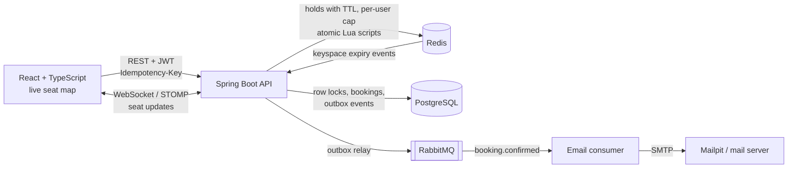

# SeatLock


A seat booking platform for campus events that guarantees a seat is never sold twice, even when hundreds of people click "book" at the same moment.


Users pick seats on a live seat map, hold them for five minutes while they check out, and confirm the booking. Every viewer sees seats change in real time, checkout is safe to retry, and a confirmation email is guaranteed to go out exactly once per booking.

**Stack:** Java 21, Spring Boot 3, Spring Security (JWT), PostgreSQL, Flyway, Redis, RabbitMQ, WebSockets (STOMP), React, TypeScript, Vite, Docker, GitHub Actions, JUnit 5, Testcontainers, k6

## Architecture



## How double booking is prevented

There are two layers, and they do different jobs.

**Layer 1: Redis holds (fast, user-facing).** When a user selects seats, the API stores `hold:{event:42}:seat:7 = <userId>` in Redis with a five-minute expiry. The check-and-set runs as a single Lua script, which Redis executes atomically, so two users can never both see a seat as free and both take it. Holds are all-or-nothing: if one of four requested seats is taken, the user gets none of them. Because holds expire on their own, a user who closes the tab never leaves seats stuck.

**Layer 2: PostgreSQL row locks (the actual guarantee).** Checkout does not trust Redis. `BookingWriter` opens a transaction, locks the requested seat rows with `SELECT ... FOR UPDATE`, confirms they are still `AVAILABLE`, then writes the booking. A second transaction that wants the same seat waits on the lock, and when it proceeds it sees the committed `BOOKED` status and fails cleanly with `409 Conflict`. This holds even if a hold expired a millisecond earlier or Redis lost its data.

**Deadlock avoidance.** Seats are always locked in ascending id order. Without that, a booking for seats [5, 7] and a simultaneous booking for [7, 5] could each lock one seat and wait forever for the other.

**Per-user hold cap.** Each user may hold at most 6 seats per event in total, across any number of requests or tabs. The hold script also tracks each user's held seats in a Redis set and checks the cap in the same atomic step, so simultaneous requests from one user cannot slip past it. Expired entries are cleaned up lazily the next time that user holds.

## Real-time seat updates

Browsers connect over WebSocket (STOMP) and subscribe to `/topic/events/{id}/seats`. After any hold, release, or booking, `SeatBroadcaster` reads the seat's current state from Postgres and Redis and pushes it, rather than trusting what the caller says changed, so racing events (a hold expiring the instant the seat is booked) still produce the correct final state.

Hold expirations happen inside Redis with no API call, so `HoldExpiryListener` subscribes to Redis keyspace notifications and broadcasts freed seats. The frontend applies pushes directly to the map, shows a live-connection indicator, and resyncs on reconnect with a slow background refresh as a safety net.

## Idempotent checkout

Every checkout sends an `Idempotency-Key` header. The key is written in the same transaction as the booking, under a primary key on `(user_id, key)`:

- **A retry after success** (double-click, lost response) finds the key and returns the original booking with `Idempotent-Replayed: true`.
- **Simultaneous retries** block on the key insert until the first transaction commits, then fail with a duplicate key and return the first booking. Ten concurrent attempts produce exactly one booking.
- **Reusing a key for a different request** is rejected with `422`.

Because retries are safe, the frontend automatically retries a booking once if the network drops mid-request.

## Reliable confirmation emails

Publishing to RabbitMQ directly after saving a booking can lose the message if the app crashes between the commit and the publish. Instead, SeatLock uses a **transactional outbox**:

1. The booking transaction also inserts a `BookingConfirmed` row into `outbox_events`. A committed booking always has its event; a rolled-back one never does.
2. `OutboxRelay` polls for unpublished rows with `FOR UPDATE SKIP LOCKED` (safe with several app instances), publishes them with publisher confirms, and marks them sent.
3. The consumer records each booking in `booking_notifications` before sending, so RabbitMQ's at-least-once redeliveries never send a second email.
4. Failed sends retry 3 times with backoff, then go to a dead-letter queue for inspection.

### Design decisions and tradeoffs

| Decision | Why | Alternative considered |
|---|---|---|
| Holds in Redis, bookings in Postgres | Holds are temporary and high-churn; bookings must be durable | Storing holds as DB rows with a cleanup job, which adds write load and a background sweeper |
| Pessimistic locking (`FOR UPDATE`) at checkout | Contention on popular seats is expected, so waiting briefly beats retrying | Optimistic locking with a `@Version` column, which produces retry storms during a rush |
| Postgres is the source of truth | Redis is an in-memory cache and can be flushed or fail over | Treating Redis as authoritative, which is faster but unsafe |
| Broadcast current state, not deltas | Messages stay correct when events race | Sending "seat 7 is now X" from each caller, which can arrive out of order |
| Transactional outbox for events | No lost or phantom emails across crashes | Publishing inside or after the transaction, which can lose or invent events |
| Consumer-side dedup table | The outbox guarantees at-least-once, not exactly-once | Trusting RabbitMQ to deliver once, which it does not promise |

## Proving it works

**28 integration tests** (`backend/src/test`) run against real Postgres, Redis, RabbitMQ, and Mailpit containers started by Testcontainers, so they exercise the actual migrations, SQL locks, Lua scripts, queues, and SMTP path rather than mocks. Highlights:

- 50 threads race for one seat: exactly one hold, and exactly one booking even when holds are bypassed.
- Overlapping multi-seat bookings in conflicting orders: no deadlocks, no seat booked twice.
- A real WebSocket client receives hold, booking, release, and Redis-expiry updates.
- 10 simultaneous retries with the same idempotency key produce one booking.
- A booking travels outbox, RabbitMQ, consumer, and SMTP into Mailpit; a redelivered message sends nothing.
- 20 simultaneous hold requests from one user: exactly 6 succeed.

**Load test** (`load-test/contested-booking.js`): 500 virtual users rush a 100-seat event simultaneously.

| Metric | Result |
|---|---|
| Concurrent users | 500 |
| Seats available | 100 |
| Seats booked | 100 (exactly one booking per seat) |
| Contested holds rejected with 409 | 1,206 |
| Failed requests | 0 of 1,910 (0.00%) |
| p95 booking latency | 330 ms |
| p95 request latency (all endpoints) | 253 ms |
| Double bookings | 0 (verified with scripts/verify-no-double-booking.sql) |

_Measured locally on a MacBook Air (Apple Silicon) with k6, and Postgres, Redis, and RabbitMQ in Docker, after Phase 2. Phase 1 without the outbox and WebSockets measured 341 ms p95 booking latency, so the extra guarantees added no measurable checkout cost._

## Running locally

**Prerequisites:** Docker, Java 21, Maven 3.9+, Node 22. Install [k6](https://grafana.com/docs/k6/latest/set-up/install-k6/) for the load test.

**Everything in Docker:**

```bash
docker compose up --build
# Frontend: http://localhost:3000   API: http://localhost:8080
```

**Development mode** (hot reload):

```bash
docker compose up -d postgres redis rabbitmq mailpit

cd backend && mvn spring-boot:run          # API on :8080
cd frontend && npm install && npm run dev   # UI on :5173, proxies /api and /ws to :8080
```

| Tool | URL | Notes |
|---|---|---|
| App (dev) | http://localhost:5173 | |
| Mailpit inbox | http://localhost:8025 | Confirmation emails land here |
| RabbitMQ dashboard | http://localhost:15672 | guest / guest |

Local Postgres is exposed on port **5433** to avoid clashing with a Postgres already installed on the machine. Set `HOLD_TTL_SECONDS=30` when starting the backend to watch holds expire quickly.

On first start the API seeds demo data:

| Account | Email | Password |
|---|---|---|
| Admin (can create events) | admin@seatlock.dev | admin12345 |
| Student | student@seatlock.dev | student12345 |

Open the app in a normal and a private window signed in as different users to watch holds appear and expire in real time.

**Tests:**

```bash
cd backend && mvn verify   # needs Docker running for Testcontainers
```

**Load test:**

```bash
ulimit -n 4096
k6 run -e USERS=500 load-test/contested-booking.js
docker compose exec -T postgres psql -U seatlock -d seatlock < scripts/verify-no-double-booking.sql
```

## API

| Method | Path | Auth | Purpose |
|---|---|---|---|
| POST | `/api/auth/register` | none | Create an account, returns a JWT |
| POST | `/api/auth/login` | none | Sign in, returns a JWT |
| GET | `/api/auth/me` | user | Current user |
| GET | `/api/events` | none | Events with open seat counts |
| GET | `/api/events/{id}` | none | One event |
| POST | `/api/events` | admin | Create an event and generate its seat grid |
| GET | `/api/events/{id}/seats` | optional | Seat map; signed-in users also see their own holds |
| POST | `/api/events/{id}/holds` | user | Hold up to 6 seats for 5 minutes (all or nothing, 6 per user per event) |
| POST | `/api/events/{id}/holds/release` | user | Release your holds |
| POST | `/api/bookings` | user | Book seats you hold; send an `Idempotency-Key` header |
| GET | `/api/bookings/me` | user | Your bookings |
| WS | `/ws` (STOMP) | none | Subscribe to `/topic/events/{id}/seats` for live changes |

Conflicts return `409` with the ids of the contested seats so the UI can say exactly which seats were lost:

```json
{ "status": 409, "message": "Someone else is holding some of these seats", "seatIds": [812, 813] }
```

## Project layout

```
backend/
  src/main/java/com/seatlock/
    auth/        JWT issue/verify, security filter, register and login
    event/       events, seat map assembly, hold endpoints
    hold/        Redis hold service, per-user cap, and its Lua scripts
    booking/     checkout flow, idempotency keys, BookingWriter (the locking transaction)
    realtime/    WebSocket config, SeatBroadcaster, Redis expiry listener
    messaging/   outbox, relay, RabbitMQ topology, confirmation email consumer
    seat/        seat entity and the FOR UPDATE query
    common/      error types and JSON error handler
  src/main/resources/db/migration/   Flyway SQL
  src/test/java/com/seatlock/        concurrency, realtime, messaging, and API tests
frontend/src/
  pages/        events list, seat selection, sign in, my bookings
  components/   SeatMap, HoldTimer
  realtime.ts   STOMP client
load-test/      k6 rush scenario
scripts/        SQL to verify data integrity after load
```

## Roadmap

- [x] **Phase 1:** core booking with Redis holds and row locking, React seat map, JWT auth, Testcontainers concurrency tests, k6 load test, Docker Compose, CI
- [x] **Phase 2:** WebSocket live updates with Redis expiry events; idempotent checkout; transactional outbox with RabbitMQ confirmation emails and dead-lettering; per-user hold cap
- [ ] **Phase 3:** AWS deployment provisioned with Terraform; Prometheus and Grafana dashboards for request rate, hold conflicts, and booking latency; admin UI for creating events

## Known limitations

- The WebSocket broker is in-memory, so live updates reach only clients connected to the same backend instance. Running several instances would need a shared broker such as RabbitMQ's STOMP plugin or Redis pub/sub.
- Idempotency keys are kept indefinitely; production would expire them after a day or so.
- Payment is simulated; booking is confirmed immediately.
