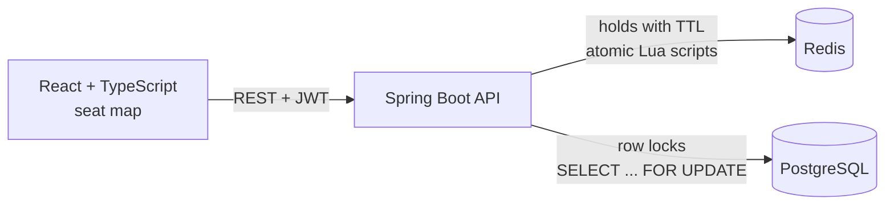

# SeatLock

A seat booking platform for campus events that guarantees a seat is never sold twice, even when hundreds of people click "book" at the same moment.

Users pick seats on a live seat map, hold them for five minutes while they check out, and confirm the booking. The interesting part is what happens underneath when many users compete for the same seats.

**Stack:** Java 21, Spring Boot 3, Spring Security (JWT), PostgreSQL, Flyway, Redis, React, TypeScript, Vite, Docker, GitHub Actions, JUnit 5, Testcontainers, k6

## Architecture



## How double booking is prevented

There are two layers, and they do different jobs.

**Layer 1: Redis holds (fast, user-facing).** When a user selects seats, the API stores `hold:{event:42}:seat:7 = <userId>` in Redis with a five-minute expiry. The check-and-set runs as a single Lua script, which Redis executes atomically, so two users can never both see a seat as free and both take it. Holds are all-or-nothing: if one of four requested seats is taken, the user gets none of them. Because holds expire on their own, a user who closes the tab never leaves seats stuck.

**Layer 2: PostgreSQL row locks (the actual guarantee).** Checkout does not trust Redis. `BookingWriter` opens a transaction, locks the requested seat rows with `SELECT ... FOR UPDATE`, confirms they are still `AVAILABLE`, then writes the booking. A second transaction that wants the same seat waits on the lock, and when it proceeds it sees the committed `BOOKED` status and fails cleanly with `409 Conflict`. This holds even if a hold expired a millisecond earlier or Redis lost its data.

**Deadlock avoidance.** Seats are always locked in ascending id order. Without that, a booking for seats [5, 7] and a simultaneous booking for [7, 5] could each lock one seat and wait forever for the other.

### Design decisions and tradeoffs

| Decision | Why | Alternative considered |
|---|---|---|
| Holds in Redis, bookings in Postgres | Holds are temporary and high-churn; bookings must be durable | Storing holds as DB rows with a cleanup job, which is simpler but adds write load and a background sweeper |
| Pessimistic locking (`FOR UPDATE`) at checkout | Contention on popular seats is expected, so waiting briefly beats retrying | Optimistic locking with a `@Version` column, which is cheaper when conflicts are rare but produces retry storms during a rush |
| Postgres is the source of truth | Redis is an in-memory cache and can be flushed or fail over | Treating Redis as authoritative, which is faster but unsafe |
| Plain id columns instead of `@ManyToOne` | Explicit queries, no lazy-loading surprises | Full JPA relationships |

## Proving it works

**Integration tests** (`backend/src/test`) run against real Postgres and Redis containers started by Testcontainers, so they exercise the actual Flyway migrations, SQL locks, and Lua scripts rather than mocks.

- 50 threads try to hold the same seat at the same instant: exactly one succeeds.
- 50 threads bypass the hold layer and hit the database directly for one seat: exactly one booking is created.
- 40 threads request overlapping seat pairs in conflicting orders: no deadlocks, no seat booked twice.
- 60 threads compete for 10 seats: exactly 10 bookings, and no booking is left owning zero seats (which is what a silent overwrite would look like).
- API tests for authentication, authorization (only admins create events), validation errors, and the full hold then book flow.

**Load test** (`load-test/contested-booking.js`): 500 virtual users rush a 100-seat event simultaneously. Pass criteria are that successful bookings never exceed the seats that exist, that the count matches what the database reports, and that `scripts/verify-no-double-booking.sql` finds zero orphaned bookings.

<!-- Fill these in with your own measured numbers after running the load test -->
| Metric | Result |
|---|---|
| Concurrent users | 500 |
| Seats available | 100 |
| Seats booked | _run and record_ |
| Double bookings | _run and record_ |
| p95 booking latency | _run and record_ |

## Running locally

**Prerequisites:** Docker, Java 21, Maven 3.9+, Node 22. Install [k6](https://grafana.com/docs/k6/latest/set-up/install-k6/) for the load test.

**Everything in Docker:**

```bash
docker compose up --build
# Frontend: http://localhost:3000   API: http://localhost:8080
```

**Development mode** (hot reload):

```bash
docker compose up -d postgres redis

cd backend && mvn spring-boot:run          # API on :8080
cd frontend && npm install && npm run dev   # UI on :5173, proxies /api to :8080
```

On first start the API seeds demo data:

| Account | Email | Password |
|---|---|---|
| Admin (can create events) | admin@seatlock.dev | admin12345 |
| Student | student@seatlock.dev | student12345 |

Open the app in two browser windows signed in as different users to watch holds appear for each other.

**Tests:**

```bash
cd backend && mvn verify   # needs Docker running for Testcontainers
```

**Load test:**

```bash
k6 run -e USERS=500 load-test/contested-booking.js
docker compose exec -T postgres psql -U seatlock -d seatlock < scripts/verify-no-double-booking.sql
```

## API

| Method | Path | Auth | Purpose |
|---|---|---|---|
| POST | `/api/auth/register` | none | Create an account, returns a JWT |
| POST | `/api/auth/login` | none | Sign in, returns a JWT |
| GET | `/api/auth/me` | user | Current user |
| GET | `/api/events` | none | Events with open seat counts |
| GET | `/api/events/{id}` | none | One event |
| POST | `/api/events` | admin | Create an event and generate its seat grid |
| GET | `/api/events/{id}/seats` | optional | Seat map; signed-in users also see their own holds |
| POST | `/api/events/{id}/holds` | user | Hold up to 6 seats for 5 minutes (all or nothing) |
| POST | `/api/events/{id}/holds/release` | user | Release your holds |
| POST | `/api/bookings` | user | Book seats you currently hold |
| GET | `/api/bookings/me` | user | Your bookings |

Conflicts return `409` with the ids of the contested seats so the UI can say exactly which seats were lost:

```json
{ "status": 409, "message": "Someone else is holding some of these seats", "seatIds": [812, 813] }
```

## Project layout

```
backend/
  src/main/java/com/seatlock/
    auth/       JWT issue/verify, security filter, register and login
    event/      events, seat map assembly, hold endpoints
    hold/       Redis hold service and its Lua scripts
    booking/    checkout flow and BookingWriter (the locking transaction)
    seat/       seat entity and the FOR UPDATE query
    common/     error types and JSON error handler
  src/main/resources/db/migration/   Flyway SQL
  src/test/java/com/seatlock/        concurrency and API tests
frontend/src/
  pages/        events list, seat selection, sign in, my bookings
  components/   SeatMap, HoldTimer
load-test/      k6 rush scenario
scripts/        SQL to verify data integrity after load
```

## Roadmap

- [x] **Phase 1:** core booking with Redis holds and row locking, React seat map, JWT auth, Testcontainers concurrency tests, k6 load test, Docker Compose, CI
- [ ] **Phase 2:** WebSocket push so seat changes appear instantly (replacing 3-second polling); RabbitMQ or Kafka for confirmation emails and a simulated payment step with idempotency keys; per-user hold cap across requests
- [ ] **Phase 3:** AWS deployment provisioned with Terraform; Prometheus and Grafana dashboards for request rate, hold conflicts, and booking latency; admin UI for creating events

## Known limitations

- The seat map polls every 3 seconds, so another user's hold can take up to 3 seconds to appear. Phase 2 fixes this with WebSockets.
- The 6-seat limit applies per hold request. A user could make several requests to hold more; Phase 2 adds a per-user cap.
- Payment is out of scope for Phase 1; booking is confirmed immediately.
